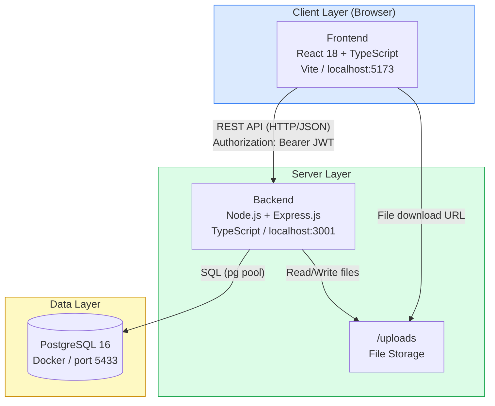
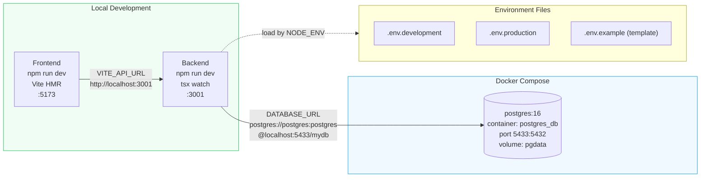
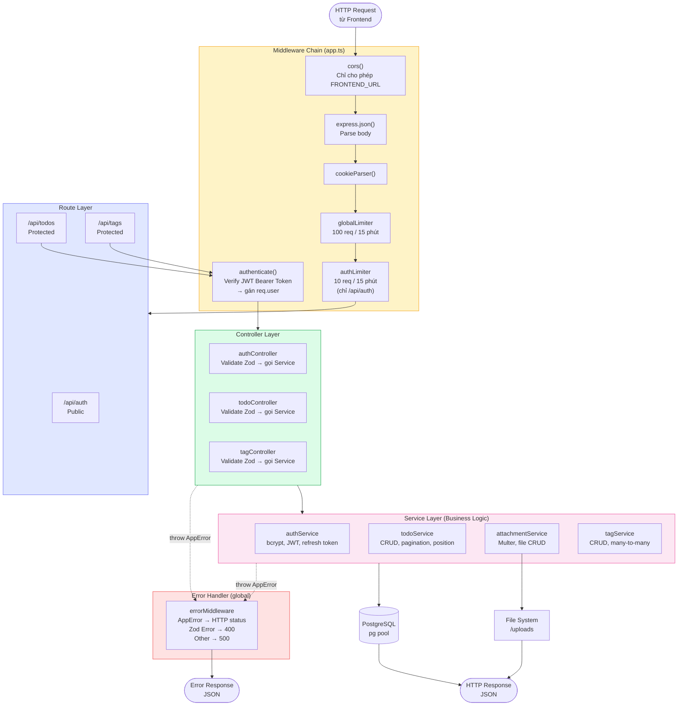
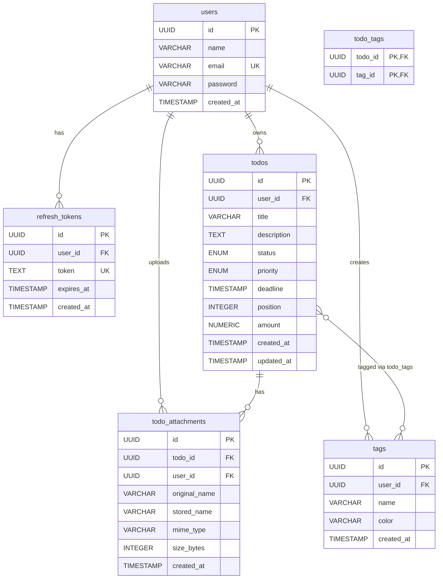
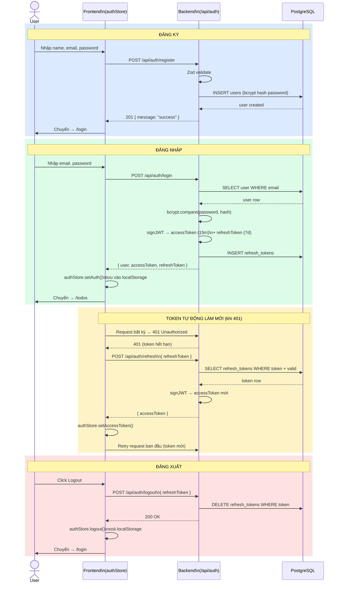
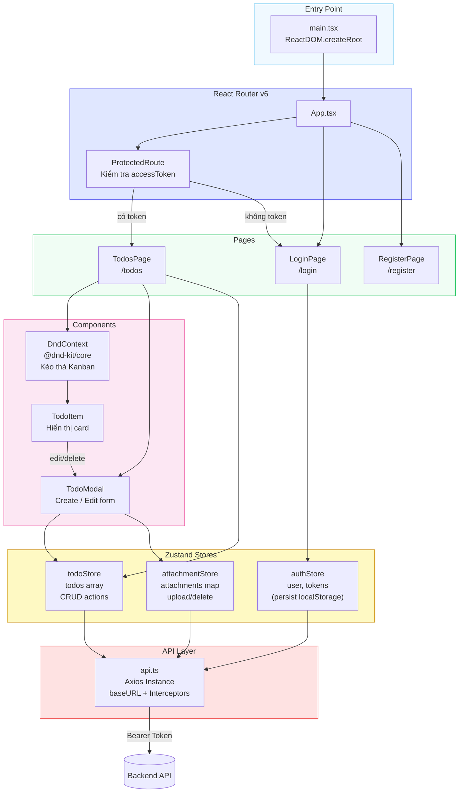
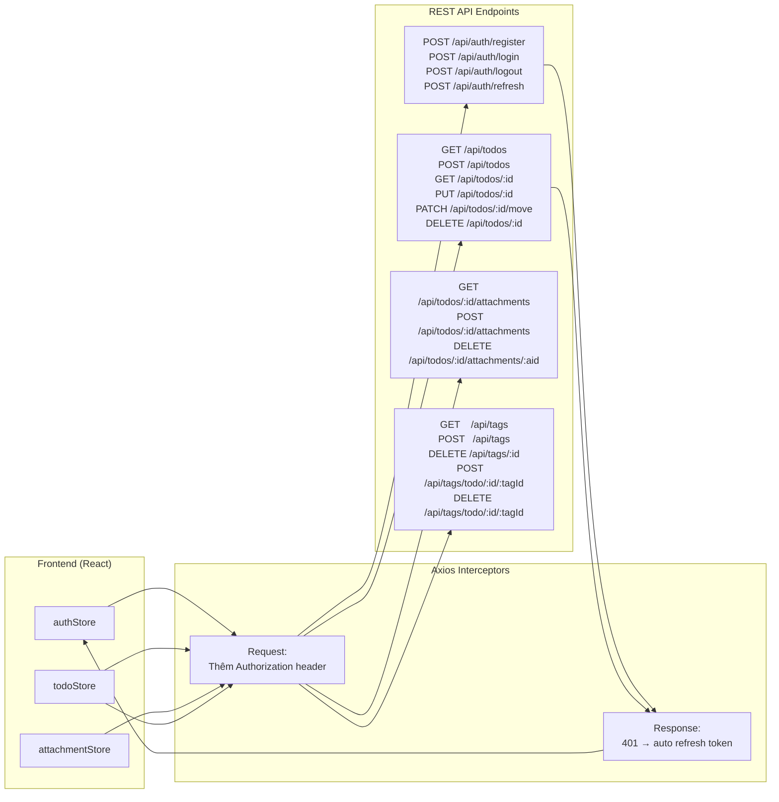
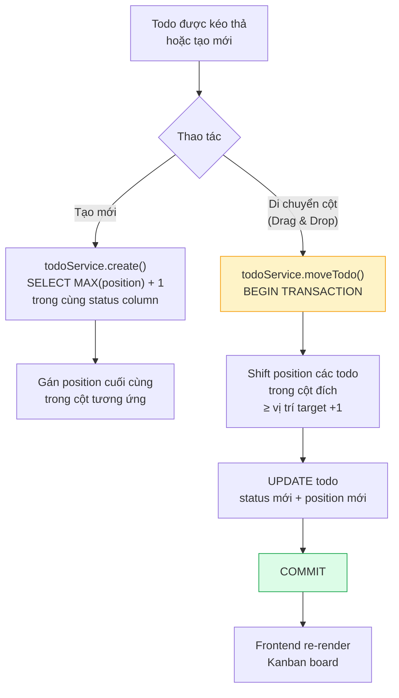
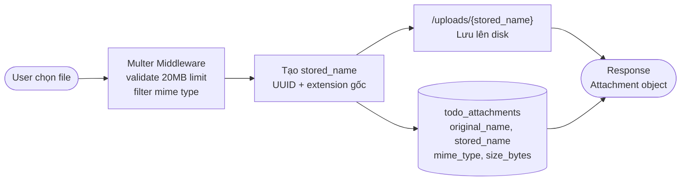

# Kiến trúc tổng thể — TodoList Project

## Mục lục
1. [Tổng quan hệ thống](#1-tổng-quan-hệ-thống)
2. [Infrastructure & Deployment](#2-infrastructure--deployment)
3. [Backend — Luồng xử lý request](#3-backend--luồng-xử-lý-request)
4. [Database Schema](#4-database-schema)
5. [Luồng xác thực (Auth Flow)](#5-luồng-xác-thực-auth-flow)
6. [Frontend — Kiến trúc & Data Flow](#6-frontend--kiến-trúc--data-flow)
7. [Giao tiếp Frontend ↔ Backend](#7-giao-tiếp-frontend--backend)
8. [Tính năng đặc biệt](#8-tính-năng-đặc-biệt)

---

## 1. Tổng quan hệ thống

---

## 2. Infrastructure & Deployment

---

## 3. Backend — Luồng xử lý request

---

## 4. Database Schema

> **Status values:** `pending` | `in_progress` | `done`
> **Priority values:** `low` | `medium` | `high`

---

## 5. Luồng xác thực (Auth Flow)

---

## 6. Frontend — Kiến trúc & Data Flow

---

## 7. Giao tiếp Frontend ↔ Backend

---

## 8. Tính năng đặc biệt

### 8.1. Kanban Position Management

### 8.2. File Upload Flow

### 8.3. Rate Limiting Strategy

| Middleware | Scope | Limit |
|---|---|---|
| `globalLimiter` | Tất cả routes | 100 req / 15 phút |
| `authLimiter` | `/api/auth/*` | 10 req / 15 phút |

### 8.4. JWT Token Strategy

| Token | Thời hạn | Lưu ở đâu | Mục đích |
|---|---|---|---|
| `accessToken` | 15 phút | Zustand (memory) | Xác thực mỗi request |
| `refreshToken` | 7 ngày | localStorage + DB | Cấp access token mới |

---

## Stack Summary

| Layer | Technology |
|---|---|
| **Frontend** | React 18, TypeScript, Vite, Tailwind CSS |
| **State** | Zustand (persist), React Hook Form, Zod |
| **Routing** | React Router v6 |
| **Drag & Drop** | @dnd-kit/core |
| **HTTP Client** | Axios (interceptors) |
| **Backend** | Node.js, Express.js, TypeScript |
| **Database** | PostgreSQL 16 (pg driver, raw SQL) |
| **Auth** | JWT (access 15m + refresh 7d), bcryptjs |
| **Validation** | Zod (backend + frontend) |
| **File Upload** | Multer (disk, 20MB) |
| **Docs** | Swagger UI (`/api-docs`, dev only) |
| **Container** | Docker Compose (PostgreSQL) |
