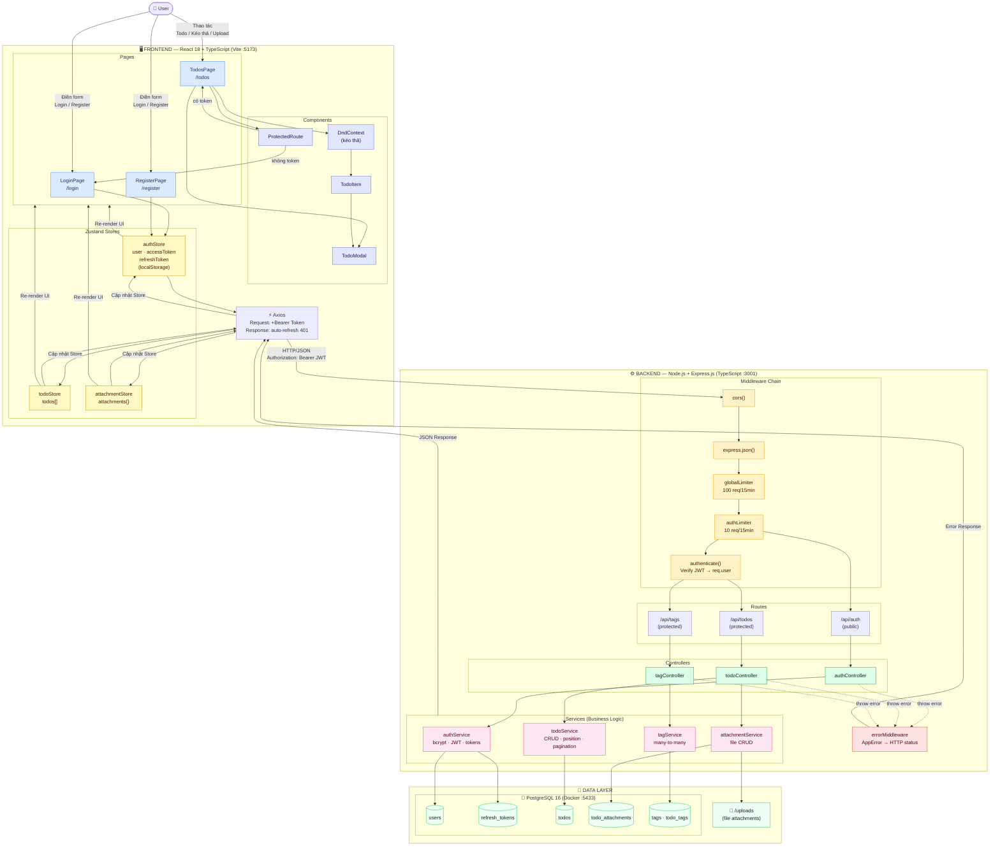

# Sơ đồ tổng thể — Frontend / Backend / Database

```
┌─────────────────────────────────────────────────────────────────────────┐
│                          CLIENT (Browser)                               │
│                                                                         │
│   ┌──────────────────────────────────────────────────────────────────┐  │
│   │                  React 18 + TypeScript + Vite                    │  │
│   │                                                                  │  │
│   │  ┌─────────────────────────┐  ┌───────────────────────────────┐  │  │
│   │  │        Pages            │  │        Components             │  │  │
│   │  │  - /login  LoginPage    │  │  - ProtectedRoute             │  │  │
│   │  │  - /register            │  │  - TodoItem  (card)           │  │  │
│   │  │  - /todos  TodosPage    │  │  - TodoModal (form)           │  │  │
│   │  │    └─ Kanban Board      │  │  - DndContext (kéo thả)       │  │  │
│   │  └─────────────────────────┘  └───────────────────────────────┘  │  │
│   │                                                                  │  │
│   │  ┌──────────────────────────────────────────────────────────┐   │  │
│   │  │                  Zustand Stores                          │   │  │
│   │  │  authStore          todoStore        attachmentStore     │   │  │
│   │  │  - user             - todos[]        - attachments{}     │   │  │
│   │  │  - accessToken      - loading        - loading           │   │  │
│   │  │  - refreshToken     - CRUD actions   - upload/delete     │   │  │
│   │  │  (localStorage)                                          │   │  │
│   │  └──────────────────────────────────────────────────────────┘   │  │
│   │                                                                  │  │
│   │  ┌──────────────────────────────────────────────────────────┐   │  │
│   │  │              Axios Instance  (api.ts)                    │   │  │
│   │  │  Request Interceptor  → thêm Authorization: Bearer JWT   │   │  │
│   │  │  Response Interceptor → 401: tự động refresh token       │   │  │
│   │  └──────────────────────────────────────────────────────────┘   │  │
│   └──────────────────────────────────────────────────────────────────┘  │
└─────────────────────────────────────────────────────────────────────────┘
                              │
              HTTPS  ·  JWT Bearer Token
                              │
                              ▼
┌─────────────────────────────────────────────────────────────────────────┐
│                  BACKEND  —  Node.js + Express.js  (:3001)              │
│                                                                         │
│  ┌────────────────────────────────────────────────────────────────────┐ │
│  │                      Middleware Chain                              │ │
│  │  cors()  →  express.json()  →  globalLimiter (100 req/15min)      │ │
│  │  →  authLimiter (10 req/15min)  →  authenticate() (verify JWT)    │ │
│  └────────────────────────────────────────────────────────────────────┘ │
│                              │                                          │
│              ┌───────────────┼───────────────┐                          │
│              ▼               ▼               ▼                          │
│   ┌──────────────┐  ┌──────────────┐  ┌──────────────┐                 │
│   │  /api/auth   │  │  /api/todos  │  │  /api/tags   │   Routes        │
│   │  (public)    │  │  (protected) │  │  (protected) │                 │
│   └──────────────┘  └──────────────┘  └──────────────┘                 │
│          │                 │                  │                         │
│          ▼                 ▼                  ▼                         │
│   ┌──────────────┐  ┌──────────────┐  ┌──────────────┐                 │
│   │authController│  │todoController│  │ tagController│   Controllers   │
│   │Zod validate  │  │Zod validate  │  │Zod validate  │                 │
│   └──────────────┘  └──────────────┘  └──────────────┘                 │
│          │                 │                  │                         │
│          ▼                 ▼                  ▼                         │
│  ┌─────────────────────────────────────────────────────────────────┐   │
│  │                       Services Layer                            │   │
│  │  ┌───────────────┐  ┌───────────────┐  ┌───────────────────┐   │   │
│  │  │  authService  │  │  todoService  │  │  attachmentService│   │   │
│  │  │  - register   │  │  - CRUD       │  │  - upload (Multer)│   │   │
│  │  │  - login      │  │  - position   │  │  - delete file    │   │   │
│  │  │  - refresh    │  │  - pagination │  │  tagService       │   │   │
│  │  │  - logout     │  │  - move (Txn) │  │  - many-to-many   │   │   │
│  │  │  bcrypt · JWT │  │               │  │                   │   │   │
│  │  └───────────────┘  └───────────────┘  └───────────────────┘   │   │
│  └─────────────────────────────────────────────────────────────────┘   │
│                              │                      │                   │
│                    errorMiddleware              Swagger UI              │
│                  AppError → HTTP status         /api-docs (dev)         │
└─────────────────────────────────────────────────────────────────────────┘
              │                                        │
              ▼                                        ▼
┌──────────────────────────────────────┐   ┌──────────────────────────┐
│   DATA LAYER                         │   │   FILE STORAGE           │
│                                      │   │                          │
│   PostgreSQL 16  (Docker :5433)      │   │   /uploads               │
│   ┌──────────────────────────────┐   │   │   - UUID filename        │
│   │  users                       │   │   │   - max 20 MB            │
│   │  refresh_tokens              │   │   │   - mime validated        │
│   │  todos                       │   │   │                          │
│   │   └─ status · priority       │   │   └──────────────────────────┘
│   │      position · amount       │   │
│   │  todo_attachments            │   │
│   │  tags                        │   │
│   │  todo_tags  (many-to-many)   │   │
│   └──────────────────────────────┘   │
└──────────────────────────────────────┘
```

---


